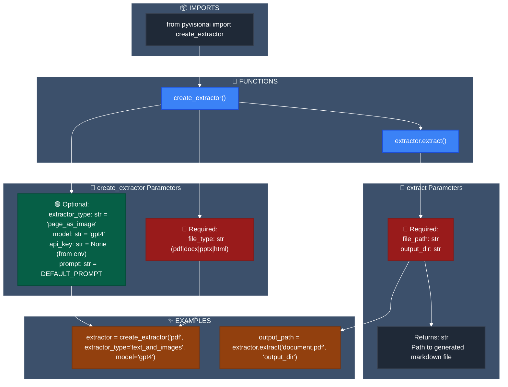

# File Extractor API

```mermaid
%%{init: {'theme': 'dark', 'themeVariables': { 'darkMode': true, 'primaryColor': '#1f2937', 'primaryTextColor': '#fff', 'primaryBorderColor': '#374151', 'lineColor': '#fff', 'textColor': '#fff', 'mainBkg': '#1f2937' }}}%%
graph TD
    classDef function fill:#3b82f6,stroke:#1d4ed8,stroke-width:2px,color:#fff
    classDef required fill:#991b1b,stroke:#7f1d1d,stroke-width:2px,color:#fff
    classDef optional fill:#065f46,stroke:#064e3b,stroke-width:2px,color:#fff
    classDef default fill:#1f2937,stroke:#374151,stroke-width:2px,color:#fff
    classDef example fill:#92400e,stroke:#78350f,stroke-width:2px,color:#fff

    subgraph IMPORTS["📦 IMPORTS"]
        Import["from pyvisionai import create_extractor"]
    end

    subgraph FUNCTIONS["🔵 FUNCTIONS"]
        Create["create_extractor()"]
        Extract["extractor.extract()"]
    end

    subgraph EXAMPLES["✨ EXAMPLES"]
        CreateExample["extractor = create_extractor('pdf', extractor_type='text_and_images', model='gpt4')"]
        ExtractExample["output_path = extractor.extract('document.pdf', 'output_dir')"]
    end

    subgraph CREATE_PARAMS["📝 create_extractor Parameters"]
        CreateRequired["🔴 Required:
        file_type: str (pdf|docx|pptx|html)"]

        CreateOptional["🟢 Optional:
        extractor_type: str = 'page_as_image'
        model: str = 'gpt4'
        api_key: str = None (from env)
        prompt: str = DEFAULT_PROMPT"]
    end

    subgraph EXTRACT_PARAMS["📝 extract Parameters"]
        ExtractRequired["🔴 Required:
        file_path: str
        output_dir: str"]

        ExtractReturn["Returns: str
        Path to generated markdown file"]
    end

    Import --> Create
    Create --> CreateRequired & CreateOptional
    Create --> Extract
    Extract --> ExtractRequired --> ExtractReturn
    CreateRequired & CreateOptional --> CreateExample
    ExtractRequired --> ExtractExample

    class Create,Extract function
    class CreateRequired,ExtractRequired required
    class CreateOptional optional
    class CreateExample,ExtractExample example
``` 