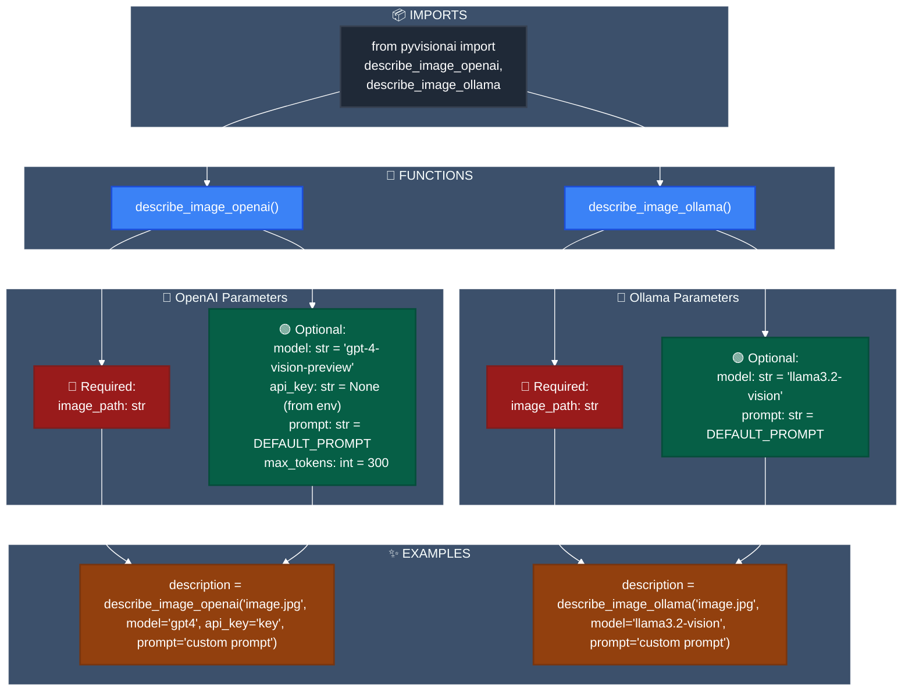

# Image Description API

```mermaid
%%{init: {'theme': 'dark', 'themeVariables': { 'darkMode': true, 'primaryColor': '#1f2937', 'primaryTextColor': '#fff', 'primaryBorderColor': '#374151', 'lineColor': '#fff', 'textColor': '#fff', 'mainBkg': '#1f2937' }}}%%
graph TD
    classDef function fill:#3b82f6,stroke:#1d4ed8,stroke-width:2px,color:#fff
    classDef required fill:#991b1b,stroke:#7f1d1d,stroke-width:2px,color:#fff
    classDef optional fill:#065f46,stroke:#064e3b,stroke-width:2px,color:#fff
    classDef default fill:#1f2937,stroke:#374151,stroke-width:2px,color:#fff
    classDef example fill:#92400e,stroke:#78350f,stroke-width:2px,color:#fff

    subgraph IMPORTS["📦 IMPORTS"]
        Import["from pyvisionai import
        describe_image_openai,
        describe_image_ollama"]
    end

    subgraph FUNCTIONS["🔵 FUNCTIONS"]
        OpenAI["describe_image_openai()"]
        Ollama["describe_image_ollama()"]
    end

    subgraph EXAMPLES["✨ EXAMPLES"]
        OpenAIExample["description = describe_image_openai('image.jpg', model='gpt4', api_key='key', prompt='custom prompt')"]

        OllamaExample["description = describe_image_ollama('image.jpg', model='llama3.2-vision', prompt='custom prompt')"]
    end

    subgraph OPENAI_PARAMS["📝 OpenAI Parameters"]
        OpenAIRequired["🔴 Required:
        image_path: str"]

        OpenAIOptional["🟢 Optional:
        model: str = 'gpt-4-vision-preview'
        api_key: str = None (from env)
        prompt: str = DEFAULT_PROMPT
        max_tokens: int = 300"]
    end

    subgraph OLLAMA_PARAMS["📝 Ollama Parameters"]
        OllamaRequired["🔴 Required:
        image_path: str"]

        OllamaOptional["🟢 Optional:
        model: str = 'llama3.2-vision'
        prompt: str = DEFAULT_PROMPT"]
    end

    Import --> OpenAI & Ollama
    OpenAI --> OpenAIRequired & OpenAIOptional --> OpenAIExample
    Ollama --> OllamaRequired & OllamaOptional --> OllamaExample

    class OpenAI,Ollama function
    class OpenAIRequired,OllamaRequired required
    class OpenAIOptional,OllamaOptional optional
    class OpenAIExample,OllamaExample example
``` 