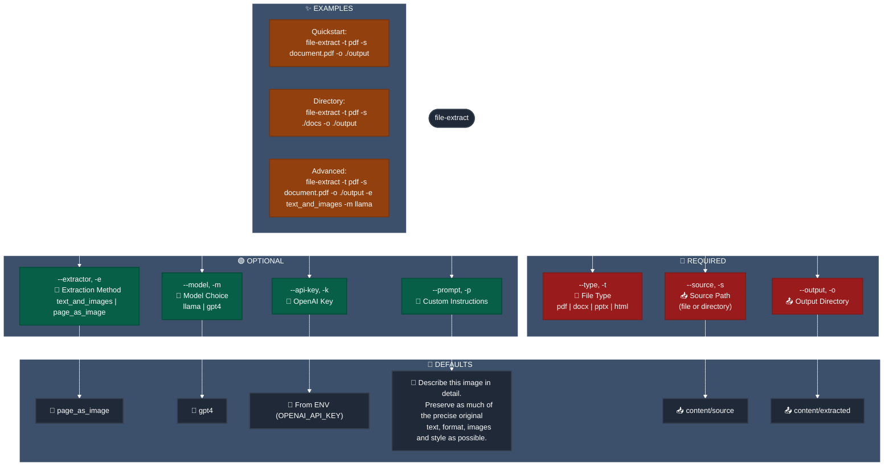

# File Extractor CLI

```mermaid
%%{init: {'theme': 'dark', 'themeVariables': { 'darkMode': true, 'primaryColor': '#1f2937', 'primaryTextColor': '#fff', 'primaryBorderColor': '#374151', 'lineColor': '#fff', 'textColor': '#fff', 'mainBkg': '#1f2937' }}}%%
graph TD
    classDef function fill:#3b82f6,stroke:#1d4ed8,stroke-width:2px,color:#fff
    classDef required fill:#991b1b,stroke:#7f1d1d,stroke-width:2px,color:#fff
    classDef optional fill:#065f46,stroke:#064e3b,stroke-width:2px,color:#fff
    classDef default fill:#1f2937,stroke:#374151,stroke-width:2px,color:#fff
    classDef example fill:#92400e,stroke:#78350f,stroke-width:2px,color:#fff

    CLI(["file-extract"])

    subgraph EXAMPLES["✨ EXAMPLES"]
        Basic["Quickstart:
        file-extract -t pdf -s document.pdf -o ./output"]

        Directory["Directory:
        file-extract -t pdf -s ./docs -o ./output"]

        Advanced["Advanced:
        file-extract -t pdf -s document.pdf -o ./output -e text_and_images -m llama"]
    end

    subgraph OPTIONAL["🟢 OPTIONAL"]
        Extractor["--extractor, -e
        📄 Extraction Method
        text_and_images | page_as_image"]

        Model["--model, -m
        🤖 Model Choice
        llama | gpt4"]

        Key["--api-key, -k
        🔑 OpenAI Key"]

        Prompt["--prompt, -p
        💭 Custom Instructions"]
    end

    subgraph REQUIRED["🔴 REQUIRED"]
        Type["--type, -t
        📄 File Type
        pdf | docx | pptx | html"]

        Source["--source, -s
        📥 Source Path
        (file or directory)"]

        Output["--output, -o
        📤 Output Directory"]
    end

    subgraph DEFAULTS["🔵 DEFAULTS"]
        ExtractorDefault["📄 page_as_image"]
        ModelDefault["🤖 gpt4"]
        KeyDefault["🔑 From ENV (OPENAI_API_KEY)"]
        PromptDefault["💭 Describe this image in detail.
        Preserve as much of the precise original
        text, format, images and style as possible."]
        SourceDefault["📥 content/source"]
        OutputDefault["📤 content/extracted"]
    end

    CLI --> Type & Source & Output
    CLI --> Extractor & Model & Key & Prompt

    Extractor --> ExtractorDefault
    Model --> ModelDefault
    Key --> KeyDefault
    Prompt --> PromptDefault
    Source --> SourceDefault
    Output --> OutputDefault

    class Type,Source,Output required
    class Extractor,Model,Key,Prompt optional
    class ExtractorDefault,ModelDefault,KeyDefault,PromptDefault,SourceDefault,OutputDefault default
    class Basic,Directory,Advanced example
``` 