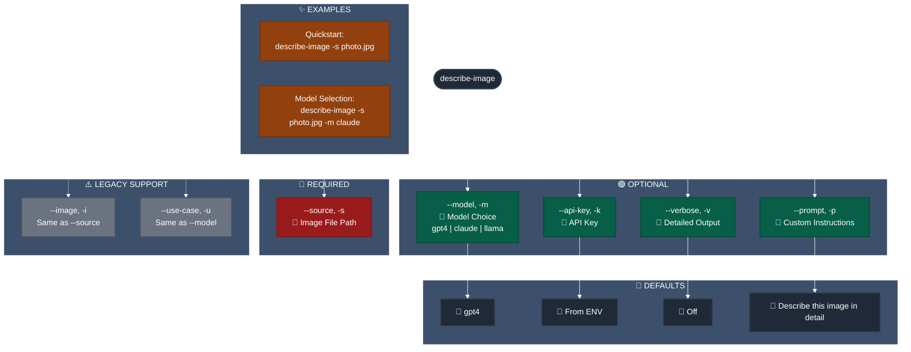

# Image Description CLI

```mermaid
%%{init: {'theme': 'dark', 'themeVariables': { 'darkMode': true, 'primaryColor': '#1f2937', 'primaryTextColor': '#fff', 'primaryBorderColor': '#374151', 'lineColor': '#fff', 'textColor': '#fff', 'mainBkg': '#1f2937' }}}%%
graph TD
    classDef function fill:#3b82f6,stroke:#1d4ed8,stroke-width:2px,color:#fff
    classDef required fill:#991b1b,stroke:#7f1d1d,stroke-width:2px,color:#fff
    classDef optional fill:#065f46,stroke:#064e3b,stroke-width:2px,color:#fff
    classDef default fill:#1f2937,stroke:#374151,stroke-width:2px,color:#fff
    classDef example fill:#92400e,stroke:#78350f,stroke-width:2px,color:#fff
    classDef legacy fill:#6b7280,stroke:#4b5563,stroke-width:2px,color:#fff

    CLI(["describe-image"])

    subgraph EXAMPLES["✨ EXAMPLES"]
        Basic["Quickstart:
        describe-image -s photo.jpg"]

        Model["Model Selection:
        describe-image -s photo.jpg -m claude"]
    end

    subgraph OPTIONAL["🟢 OPTIONAL"]
        ModelOpt["--model, -m
        🤖 Model Choice
        gpt4 | claude | llama"]

        Key["--api-key, -k
        🔑 API Key"]

        Verbose["--verbose, -v
        📝 Detailed Output"]

        Prompt["--prompt, -p
        💭 Custom Instructions"]
    end

    subgraph REQUIRED["🔴 REQUIRED"]
        Source["--source, -s
        📸 Image File Path"]
    end

    subgraph LEGACY["⚠️ LEGACY SUPPORT"]
        ImageLegacy["--image, -i
        Same as --source"]
        
        UseCaseLegacy["--use-case, -u
        Same as --model"]
    end

    subgraph DEFAULTS["🔵 DEFAULTS"]
        ModelDefault["🤖 gpt4"]
        KeyDefault["🔑 From ENV"]
        VerboseDefault["📝 Off"]
        PromptDefault["💭 Describe this image in detail"]
    end

    CLI --> Source
    CLI --> ModelOpt & Key & Verbose & Prompt
    CLI -.-> ImageLegacy & UseCaseLegacy

    ModelOpt --> ModelDefault
    Key --> KeyDefault
    Verbose --> VerboseDefault
    Prompt --> PromptDefault

    class Source required
    class ModelOpt,Key,Verbose,Prompt optional
    class ModelDefault,KeyDefault,VerboseDefault,PromptDefault default
    class Basic,Model example
    class ImageLegacy,UseCaseLegacy legacy
``` 