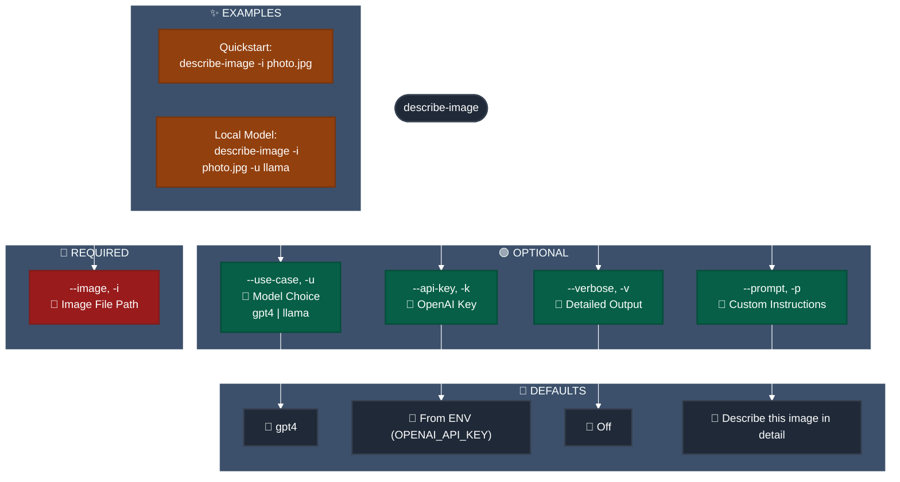

# Image Description CLI

```mermaid
%%{init: {'theme': 'dark', 'themeVariables': { 'darkMode': true, 'primaryColor': '#1f2937', 'primaryTextColor': '#fff', 'primaryBorderColor': '#374151', 'lineColor': '#fff', 'textColor': '#fff', 'mainBkg': '#1f2937' }}}%%
graph TD
    classDef function fill:#3b82f6,stroke:#1d4ed8,stroke-width:2px,color:#fff
    classDef required fill:#991b1b,stroke:#7f1d1d,stroke-width:2px,color:#fff
    classDef optional fill:#065f46,stroke:#064e3b,stroke-width:2px,color:#fff
    classDef default fill:#1f2937,stroke:#374151,stroke-width:2px,color:#fff
    classDef example fill:#92400e,stroke:#78350f,stroke-width:2px,color:#fff

    CLI(["describe-image"])

    subgraph EXAMPLES["✨ EXAMPLES"]
        Basic["Quickstart:
        describe-image -i photo.jpg"]

        Local["Local Model:
        describe-image -i photo.jpg -u llama"]
    end

    subgraph OPTIONAL["🟢 OPTIONAL"]
        Model["--use-case, -u
        🤖 Model Choice
        gpt4 | llama"]

        Key["--api-key, -k
        🔑 OpenAI Key"]

        Verbose["--verbose, -v
        📝 Detailed Output"]

        Prompt["--prompt, -p
        💭 Custom Instructions"]
    end

    subgraph REQUIRED["🔴 REQUIRED"]
        Image["--image, -i
        📸 Image File Path"]
    end

    subgraph DEFAULTS["🔵 DEFAULTS"]
        ModelDefault["🤖 gpt4"]
        KeyDefault["🔑 From ENV (OPENAI_API_KEY)"]
        VerboseDefault["📝 Off"]
        PromptDefault["💭 Describe this image in detail"]
    end

    CLI --> Image
    CLI --> Model & Key & Verbose & Prompt

    Model --> ModelDefault
    Key --> KeyDefault
    Verbose --> VerboseDefault
    Prompt --> PromptDefault

    class Image required
    class Model,Key,Verbose,Prompt optional
    class ModelDefault,KeyDefault,VerboseDefault,PromptDefault default
    class Basic,Local example
``` 