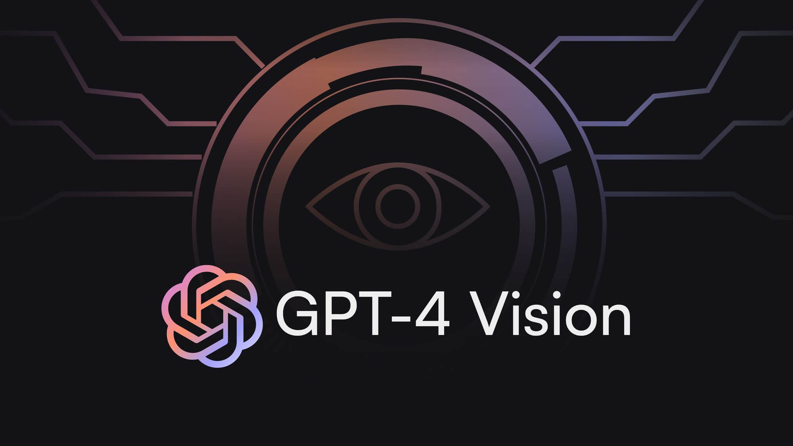
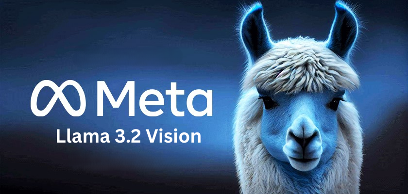

# PyVisionAI: Content Extractor and Image Description with Vision LLM

## Transforming Content Processing with Vision Language Models

## Features

- 📄 Extract text and images from PDF, DOCX, PPTX, and HTML files.
- 🖼️ Capture interactive HTML pages as images with full rendering.
- 📝 Describe images using:
  - Cloud-based models (OpenAI GPT-4 Vision, Anthropic Claude Vision)
    
  - Local models (Ollama's Llama Vision)
    
- 💾 Save extracted text and image descriptions in markdown format.
- 🛠️ Support for both CLI and library usage.
- 📊 Multiple extraction methods for different use cases.
- 📋 Detailed logging with timestamps for all operations.
- ⚙️ Customizable image description prompts.
- 🔄 Robust retry mechanism with configurable strategies.

## System Requirements

### Hardware and OS
- Python 3.8 or higher
- Operating system: Windows, macOS, or Linux
- Disk space: At least 1GB free space (more if using local Llama model)

### Required Software
- **LibreOffice**: Required for DOCX/PPTX processing
- **Poppler**: Required for PDF processing
- **Playwright**: Required for HTML processing

See [Installation Guide](documentation/installation.md) for detailed setup instructions.

### Latest Release: v0.3.1 (February 23, 2025)
PyVisionAI is continuously updated to ensure security and reliability. 
All versions to date have been certified secure, with no known vulnerabilities reported across any release.

### Traction

PyVisionAI is gaining traction ([sources: [PyPI Stats](https://pypistats.org/packages/pyvisionai), GitHub Traffic]):

- 📦 722 monthly PyPI downloads
- 📈 171 weekly PyPI downloads
- 👀 326 repository views from 123 unique visitors
- 🔄 34 repository clones from 31 unique developers

### Why Choose PyVisionAI?
- ✨ Simplified installation and setup
- 🔧 A robust framework designed for diverse file formats
- 👥 Active community support and regular updates
- 🔒 Prioritized security and performance with every release

## Quick Start

```bash
# Install PyVisionAI
pip install pyvisionai

# Process your first file
file-extract -t pdf -s path/to/file.pdf -o output_dir

# Describe an image
describe-image -s path/to/image.jpg
```

[Get Started →](documentation/getting-started.md){ .md-button .md-button--primary }
[View on GitHub →](https://github.com/MDGrey33/pyvisionai){ .md-button }

---

### Special Thanks

This project wouldn't exist without the incredible Python community, especially:

- [Talk Python To Me](https://talkpython.fm/) - Michael Kennedy's podcast that helps developers dive deep into Python
- [Real Python Podcast](https://realpython.com/podcasts/rpp/) - Weekly Python tips and interviews by Christopher Bailey

These podcasts transformed me from a Python enthusiast to a library author. Thank you for making Python accessible and exciting!

---


---

### Further Reading

Explore our detailed publication on Ready Tensor for an in-depth understanding of PyVisionAI's capabilities and applications:

[PyVisionAI: Agentic AI for Intelligent Document Processing and Visual Understanding](https://app.readytensor.ai/publications/pyvisionai-agentic-ai-for-intelligent-document-processing-and-visual-understanding-Iah5tcj36T0l)
